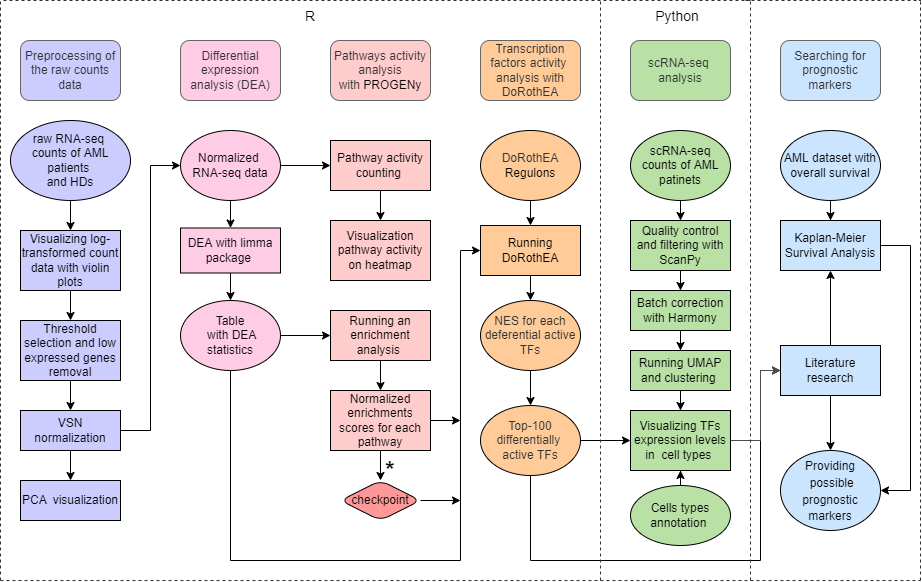
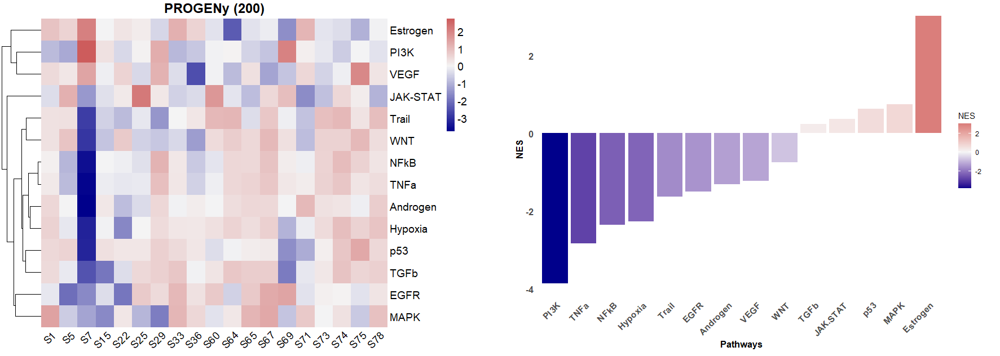
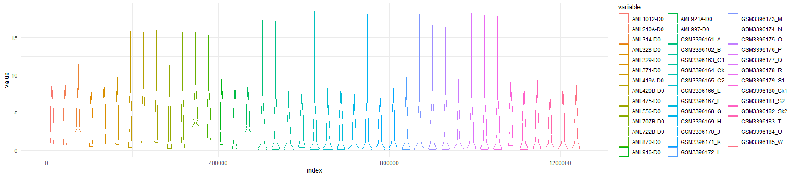
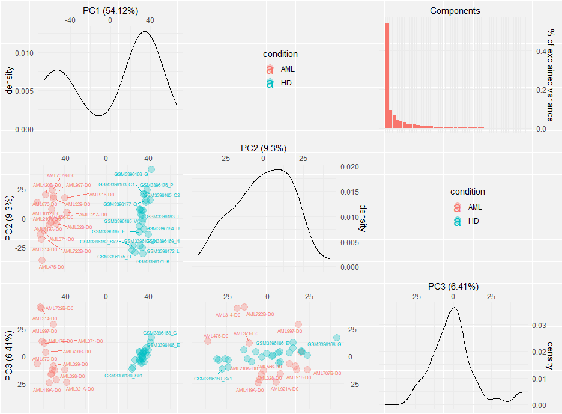
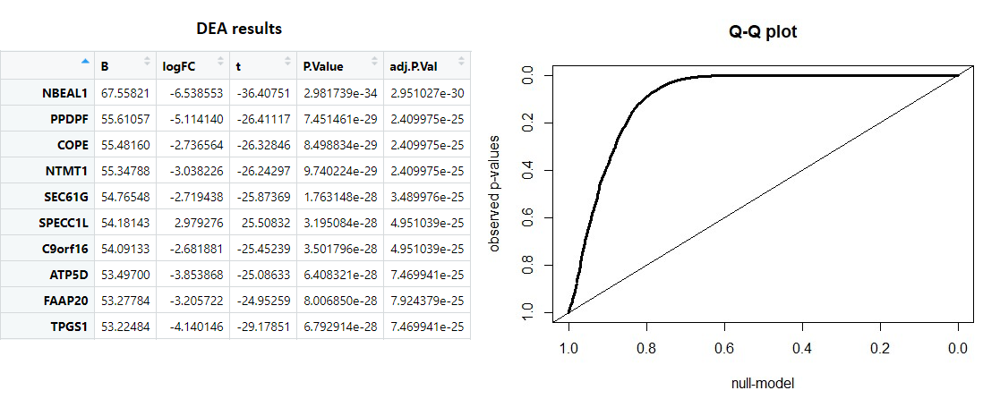
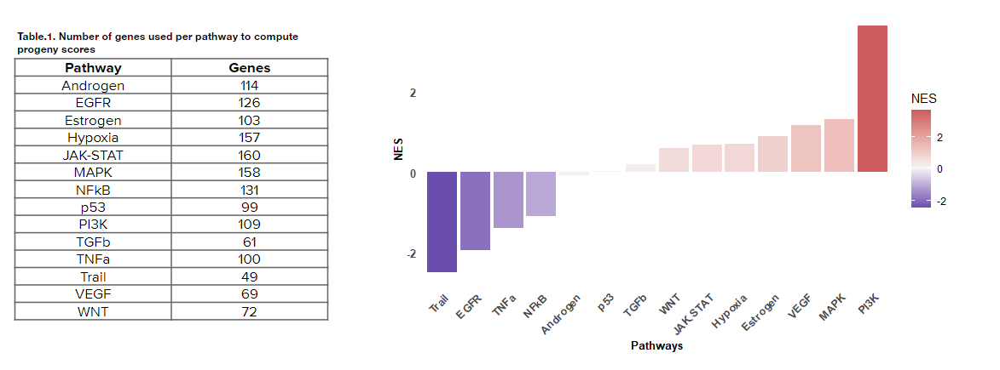

# Research of signaling pathways and transcriptional factors activity alteration associated with acute myeloid leukemia

Authors:
- Ekaterina Osintseva
- Iuliia Ruzhenkova
- Eleonora Belykh

## Introduction

Acute myeloid leukemia (AML) is a heterogeneous group of oncohematological neoplasms, which is characterized by uncontrolled proliferation of immature myeloid cells (blasts) and their accumulation in bone marrow, leading to inhibition of normal hematopoiesis. AML is the most common form of acute leukemia in adults having the shortest survival (5-year survival = 24%) and high rates of relapse ([Shallis et al., 2019](https://www.sciencedirect.com/science/article/abs/pii/S0268960X18301395?via%3Dihub)).

One of the possible reasons for the malignant transformation of hematopoietic cells are mutations, translocations, or aberrant activity of transcriptional factors ([Khan, I. et al., 2021](https://www.ncbi.nlm.nih.gov/pmc/articles/PMC9052200/)). Therefore, a better understanding of the mechanisms of transcriptional regulation can help develop new therapeutic strategies and identify prognostic markers.

## Aim, objectives and data

The aim of the project was to investigate signalling pathways activity alteration and TFs expression in the AML patients cells while performing RNAseq analysis.
The following objectives were set in order to achieve the goal:Thus, a better understanding of the mechanisms of transcriptional regulation can help develop new therapeutic strategies and identify prognostic markers.

0. Explore the topic (literature review) 
1. Download and preprocess publicly available pseudo-bulk RNAseq data of AML patients and healthy donors (HDs) 
2. Perform the differential expression analysis of normalised pseudo-bulk RNAseq dataset
3. Run PROGENy and DoRothEA tools to estimate the signaling pathways and transcriptional factors activity 
4. Validate the findings on the scRNAseq data 
5. Provide the possible prognostic markers

Publicly available datasets from Gene Expression Omnibus (GEO) were used:
- bulk RNA-seq from AML patients' and HDs' bone marrow ([GSE138702](https://www.ncbi.nlm.nih.gov/geo/query/acc.cgi?acc=GSE138702));
- single cell RNA-seq from AML patients' ([GSE116256](https://www.ncbi.nlm.nih.gov/geo/query/acc.cgi)) and HDs' bone marrow ([GSE120221](https://www.ncbi.nlm.nih.gov/geo/query/acc.cgi))

Also AML dataset with overall survival data was used to perform Kaplan-Meier analysis ([dbGaP phs001657.v1.p1](https://www.ncbi.nlm.nih.gov/projects/gap/cgi-bin/study.cgi?study_id=phs001657.v1.p1&phv=417530&phd=&pha=&pht=9391&phvf=&phdf=&phaf=&phtf=&dssp=1&consent=&temp=1)).

## Workflow
The workflow of the project presented at the following scheme. 

 \*  Checking the accordance of the obtained pathways activities with the literature data

All the tutorials for bulk and pseudo-bulk RNA-seq data analysis were taken from the open GitHub page of [Saez Lab](https://github.com/saezlab/transcriptutorial).

### Bulk RNA-seq data

At the first stage of the work, we downloaded the RNA sequencing data (GSE138702), preprocessed the data according to the tutorials, and analyzed the activity of signaling pathways using the PROGENy method (Detailed description of these steps will be below). However, we found a discrepancy with the literature data and subsequently found that there were not enough genes in this dataset for correct further processing (for calculating pathway activity scores).

Moreover, the S7 AML sample showed extreme scores and could change the whole picture of pathways activity estimation, the heatmap illustrating this is given below. Therefore, we decided to change the dataset.

### Pseudo-bulk RNA-seq data
#### Preprocessing of the raw counts data

We downloaded open source bone marrow scRNA-seq data of AML patients and HDs. Untreated AML patients only were taken into the sample. Thus, the work was carried out with 16 AML patients and with 25 HDs. Firstly, scRNAseq data was transformed to pseudo-bulk. Then log2-transformed pseudo-bulk RNAseq counts were visualized using violin plots to choose the threshold for low expressed genes cutoff. We chose the threshold for log2(counts + 1)  transformed gene expressions at level 1.5.

Genes with expression lower than the threshold in less than a half of patients from each group were removed. After low expressed genes removal 9897 genes remained.
 
Then  pseudo-bulk RNAseq counts were normalized with the VSN package, in which the variance stabilization and calibration method of normalization was implemented ([Huber et al., 2002](https://pubmed.ncbi.nlm.nih.gov/12169536/)).
Principal component analysis (PCA) carried out and visualized. Plot below shows that AML patients and HDs are well separated.

#### Differential expression analysis

Then we performed differential expression analysis (DEA) on normalized data using the limma R package ([Matthew E. Ritchie et al., 2015](https://www.researchgate.net/publication/271332965_LIMMA_powers_differential_expression_analyses_for_RNA-sequencing_and_microarray_studies/link/5639b7c808aecf1d92a9cbed/download)). We received a table of genes sorted by p-value, which contains DEA main statistics such as logFC, adjusted p-value (Table 1). We also plotted qqplot (observed p-value distribution plotted against a random baseline). The black line deviates from the diagonal strongly enough, which means that the data of healthy and AML samples differ quite a lot. 

#### Pathways activity analysis with PROGENy

For estimating the pathway activity we run PROGENy (Pathway RespOnsive GENes), a program which allows to infer the pathway activity indirectly, based on consensus gene signatures ([Schubert et al., 2018](https://www.nature.com/articles/s41467-017-02391-6); [Holland et al., 2019](https://pubmed.ncbi.nlm.nih.gov/31525460/); [Holland et al., 2020](https://genomebiology.biomedcentral.com/articles/10.1186/s13059-020-1949-z)). PROGENy was installed as a Bioconductor package. At the first step we downloaded normalized counts and DEA table results obtained in the previous steps to compute PROGENy scores for each sample. The 200 most responsible genes per pathway were chosen for the program running. However, not all of these genes were found in the dataset (Table 2). This can explain the following possible misaccordance of the results with the literature data. 

The obtained PROGENy scores were performed at the heatmap, which illustrated a good separation of pathway activities between two groups.

Then we ran the enrichment analysis to assess the significance of the pathway activity scores and performed the results at the histogram (Progeny NES график). The most activated (PI3K) and deactivated (Trail) pathways correspond with the literature data about pathway activity alteration during AML. PI3K, or, the phosphatidylinositol-3-kinase pathway, is described as important in normal and malignant hematopoiesis, involved in cell proliferation, differentiation and survival ([Salihanur Darici et al., 2020](https://www.ncbi.nlm.nih.gov/pmc/articles/PMC7563273/)). PI3K pathway is often detected as constitutively activated in AML cells, with FLT3 mutations as one of the driving mechanisms. This matches our dataset genetic landscape (38% of patients carry FLT3 mutations). 

## Literature

Khan, I., Eklund, E. E., & Gartel, A. L. (2021). Therapeutic Vulnerabilities of Transcription Factors in AML. Molecular cancer therapeutics, 20(2), 229–237. https://doi.org/10.1158/1535-7163.MCT-20-0115

Shallis RM, Wang R, Davidoff A, Ma X, Zeidan AM. Epidemiology of acute myeloid leukemia: Recent progress and enduring challenges. Blood Rev. 2019 Jul;36:70-87. doi: 10.1016/j.blre.2019.04.005. Epub 2019 Apr 29. PMID: 31101526.

